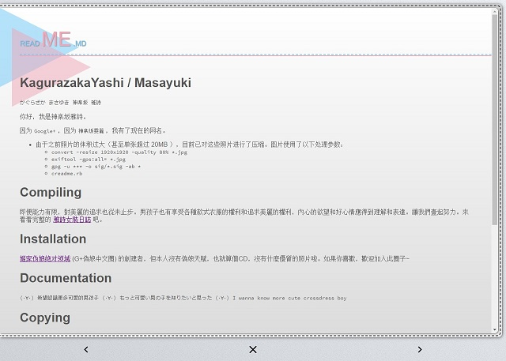
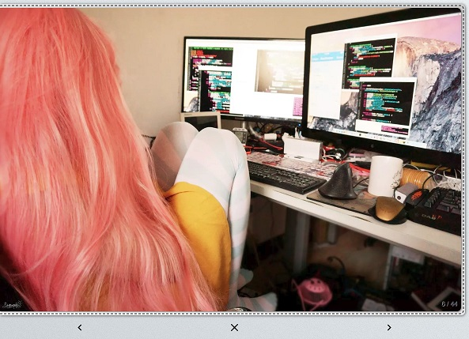
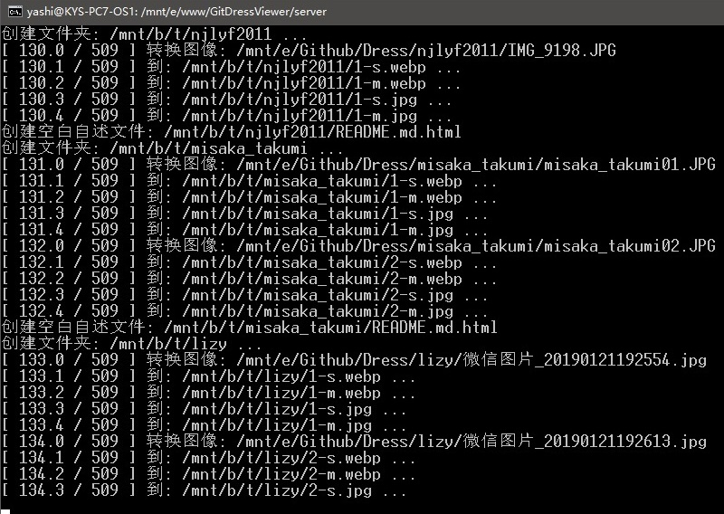

# DressViewer

用来在网页中浏览 [Dress](https://github.com/komeiji-satori/Dress) 项目。

也可以用于浏览其他类似的图库项目（自行部署）。

# 浏览指南

## 网址

见项目页上方简介区的网址。

## 基本要求

### 浏览器支持

请使用以下浏览器访问，以保证页面正常工作。

对于以下列表以外的浏览器，或低于括号中的建议版本，不保证画面和功能完整呈现。

- Google Chrome (Desktop / Android 71.0.3578.98) (推荐)
- Firefox (Desktop / Android* 64.0.2)
- Safari (iOS 12 / macOS Mojave)
- Microsoft Edge (44.17763.1.0)
- Internet Explorer (11.195.17763.0*)
- Tencent X5 Android (Wechat 7.0.0 / QQ 7.9.0.3820*)

`* 表示在此环境/版本下运行帧数较其他低一些`

已知不支持或不打算支持的浏览器：

- MIUI 自带浏览器
- 360 安全浏览器

网页会自动检查浏览器是否支持 `webp` 格式图片，如果浏览器不支持将自动提供 `jpg` 格式的图片。由于 `webp` 可以带来更好的浏览体验，因此推荐使用 Google Chrome 浏览器浏览。

## 使用技巧

- 除了使用鼠标滚轮和点按下方的功能按钮翻页和浏览，还支持：
  - 可以通过键盘的箭头键、WSAD键、上下翻页键、空格键来进行滚动浏览。
  - 相册页可以通过左划、右划触摸屏手势来进行翻页。
- 在图库的个人文件夹中的 `README.md` 可以被读出，并显示在相册浏览页的第一页。如果当前相册没有，则会进入相册浏览页时自动把第一页翻过去。

## 版权尊重

- 请勿使用本项目收集未经许可或违反其许可的图片内容。
- 任何情况下请勿在违反图片提供者内容许可的情况下盗图、盗链。
- 本项目使用的协议不对其收录的内容生效，收集的内容由内容提供者确定协议。

## 截图

# 部署指南

克隆本仓库后，应进行以下操作：

## 依赖项

制作时使用的系统是 `macOS Mojave` 和 `Windows 10: Ubuntu Bash`，脚本未在其他系统中进行测试。

1. 在系统中安装 `imagemagick` ，并且应支持 `webp` 转换。应确认 `convert <filename>.jpg <filename>.webp` 命令可用。
2. 安装 `pip install markdown2` ，确认 `markdown2` 命令可用。
3. 进入 `html` 文件夹，安装 `npm i jquery` 。

## 设置路径

1. `git clone` 一个相册项目（如 Dress ）。
2. 安装网页服务器，将 `html` 文件夹复制到需要的位置。
3. 修改 `convimg.sh` 文件，设置：
  - 克隆的相册项目路径。
  - 临时文件夹路径。
  - 网页服务中相册的路径。
  - 大图和缩略图的尺寸、压缩率。
  - 详情请见该文件中的注释。

## 编译图库

执行 `./convimg.sh` 文件：

  - 脚本会自动生成网页所需的大小两种尺寸的 `jpg` 和 `webp` 两种格式的图片，并生成所需的相关 `json` 文件，对 `md` 文件进行转换……等等操作。
  - 这可能需要几分钟的时间或更久，取决于图片仓库的大小。
  - 注意 log 中是否有显示错误，以便及时处理。
  - 文件总量为预估值，可能与最后实际转换的文件数量有所出入。

提示：

- 可以通过设定计划任务，来定时执行 `git fetch` 和 `./convimg.sh` ，已定时更新网页内容。数据更新时间会显示在主页下方。
- 所有路径建议用绝对路径。不要以/结尾。由于操作前会清空文件夹，请不要放自己其他的网页，更不要直接设置为/，将会导致删光光……

## 网页参数

以下网页可以接收参数，全都使用 `GET` 方式：

### album.html

- scroll
  - (int) 进入网页后直接滚动到此 x 坐标，通常同于从其他网页返回时从当前位置继续浏览。

### index.html

- id
  - (int) 可选，指定相册ID。
- name
  - (string) 指定相册名称。
- scroll
  - (int) 返回到相册列表页时直接滚动到此 x 坐标。

## 截图

